# Telemedicine & Healthcare Management Platform

> **Backend Architecture Reference** — FastAPI · SQLAlchemy 2.0 · PostgreSQL · Redis · Celery · Kubernetes
> **Multi-tenant SaaS** — Row-level tenancy · PostgreSQL RLS · JWT tenant context

---

## Table of Contents

1. [Project Overview](#1-project-overview)
2. [Multi-Tenancy Architecture](#2-multi-tenancy-architecture)
3. [System Architecture](#3-system-architecture)
4. [Technology Stack & Rationale](#4-technology-stack--rationale)
5. [Database Design Principles](#5-database-design-principles)
6. [Module Breakdown](#6-module-breakdown)
7. [Entity Relationship Diagram](#7-entity-relationship-diagram)
8. [Analytics — Star Schema Design](#8-analytics--star-schema-design)
9. [FastAPI Project Structure](#9-fastapi-project-structure)
10. [Scalability Design (Kubernetes)](#10-scalability-design-kubernetes)
11. [Infrastructure Decisions](#11-infrastructure-decisions)
12. [Path to Production](#12-path-to-production)
13. [Implementation Phases](#13-implementation-phases)

---

## 1. Project Overview

A **multi-tenant SaaS** telemedicine platform where each **tenant is an independent healthcare entity** — a hospital chain, clinic network, diagnostic centre, or standalone telemedicine provider. Tenants are fully data-isolated from each other. A single deployment serves all tenants simultaneously with zero infrastructure duplication per tenant.

### User Roles (per tenant)

| Role | Core Capabilities |
|---|---|
| **Patient** | Book appointments, attend video consultations, manage insurance, view prescriptions & medical records, order medicines |
| **Doctor** | Manage schedule, conduct video consultations, review AI-generated SOAP notes, issue digital prescriptions, view patient history |
| **Hospital Admin** | Manage doctors/patients, monitor billing & claims, Revenue Cycle Management (RCM) dashboard, insurance verification oversight |
| **Medical Coder** | Review and approve AI-suggested ICD/CPT codes before claim submission |
| **Pharmacist** | Process and dispatch medicine orders within tenant |

### Core Workflow

```
Patient Books Appointment
  └── Insurance Verified (async Celery task, per-tenant payer config)
        └── Video Consultation (LiveKit — room scoped to tenant)
              └── AI Transcript Generated (Whisper + LLM SOAP structuring)
                    └── Doctor Approves SOAP Notes
                          └── Digital Prescription Issued
                                └── AI Suggests ICD/CPT Codes
                                      └── Medical Coder Approves
                                            └── Insurance Claim Auto-submitted
                                                  └── Admin Reviews RCM
                                                        └── Invoice Generated → Payment Collected
```

---

## 2. Multi-Tenancy Architecture

### Strategy Comparison

Three multi-tenancy strategies exist. The choice for this platform is **row-level multi-tenancy with PostgreSQL RLS**.

| Strategy | Isolation | Scale | Migration complexity | Right for this app |
|---|---|---|---|---|
| **Database per tenant** | Perfect | Poor (100s of DBs) | Extreme (run on every DB) | No — too expensive at scale |
| **Schema per tenant** | Good | Fair (~100 tenants) | High (per-schema Alembic runs) | No — caps out too early |
| **Row-level + RLS** ✓ | Strong | Excellent (10,000+ tenants) | None (single migration) | **Yes** |

### Data Layout

```
┌───────────────────────────────────────────────────────────────┐
│                  PostgreSQL (single DB, single schema)        │
│                                                               │
│  ┌──────────────────────────────────────────────────────┐    │
│  │  tenants   ← root entity, one row per client         │    │
│  └──────────────────────────────────────────────────────┘    │
│                                                               │
│  TENANT-SCOPED TABLES (tenant_id column on every row)        │
│  users · patients · doctors · hospitals (branches)           │
│  appointments · consultation_sessions · medical_encounters   │
│  prescriptions · insurance_providers · claims · invoices     │
│  payments · medicine_orders · notifications                  │
│                                                               │
│  SHARED REFERENCE TABLES (no tenant_id — global data)        │
│  icd_codes · cpt_codes · medicines · specializations         │
└───────────────────────────────────────────────────────────────┘
```

### Tenant Root Table

```sql
CREATE TABLE tenants (
    id                UUID PRIMARY KEY DEFAULT gen_random_uuid(),
    slug              VARCHAR(100) UNIQUE NOT NULL,  -- subdomain: "apollo", "fortis"
    name              VARCHAR(300) NOT NULL,
    type              VARCHAR(50) CHECK (type IN (
                          'hospital', 'clinic', 'diagnostic_center', 'telemedicine'
                      )),
    subscription_plan VARCHAR(50) DEFAULT 'starter',
    is_active         BOOLEAN DEFAULT TRUE,
    settings          JSONB DEFAULT '{}',
    --  {
    --    "features": {
    --      "video_consultation":    true,
    --      "ai_transcript":         true,
    --      "insurance_integration": false,   ← feature-gated per plan
    --      "multi_branch":          true,
    --      "max_doctors":           50,
    --      "max_appts_per_month":   10000
    --    },
    --    "config": {
    --      "currency":              "INR",
    --      "timezone":              "Asia/Kolkata",
    --      "slot_duration_minutes": 20,
    --      "branding": { "logo_url": "...", "primary_color": "#0057B8" }
    --    }
    --  }
    contact_email     VARCHAR(255),
    created_at        TIMESTAMPTZ DEFAULT now(),
    updated_at        TIMESTAMPTZ DEFAULT now()
);
```

### Tenant Identification Flow

```
Incoming Request
      │
      ▼
┌─────────────────────────────────────────────────────┐
│  TenantMiddleware                                   │
│                                                     │
│  1. Read Host header                                │
│     apollo.yourdomain.com  →  slug = "apollo"       │
│                                                     │
│  2. Redis lookup: GET tenant:{slug}                 │
│     Cache miss → SELECT id FROM tenants             │
│                  WHERE slug = 'apollo' AND active   │
│     Cache set for 1 hour                            │
│                                                     │
│  3. request.state.tenant_id = UUID                  │
└──────────────────────┬──────────────────────────────┘
                       │
                       ▼
┌─────────────────────────────────────────────────────┐
│  JWT Validation — get_current_user()                │
│                                                     │
│  Token: { sub, tenant_id, role, exp }               │
│  Assert: token.tenant_id == request.state.tenant_id │
│  Blocks cross-tenant token reuse                    │
└──────────────────────┬──────────────────────────────┘
                       │
                       ▼
┌─────────────────────────────────────────────────────┐
│  DB Session — TenantSession                         │
│                                                     │
│  await db.execute(                                  │
│      "SET LOCAL app.current_tenant = :tid",         │
│      {"tid": str(tenant_id)}                        │
│  )                                                  │
│                                                     │
│  App layer:  WHERE tenant_id = :tid   (primary)     │
│  RLS policy: USING (tenant_id =                     │
│    current_setting('app.current_tenant')::uuid)     │
│                                (safety net)         │
└─────────────────────────────────────────────────────┘
```

### PostgreSQL Row Level Security

```sql
-- Applied to EVERY tenant-scoped table in the migration

ALTER TABLE appointments ENABLE ROW LEVEL SECURITY;

-- Read / update / delete isolation
CREATE POLICY tenant_isolation ON appointments
    USING (tenant_id = current_setting('app.current_tenant')::uuid);

-- Insert guard
CREATE POLICY tenant_insert ON appointments
    WITH CHECK (tenant_id = current_setting('app.current_tenant')::uuid);

-- App role has RLS enforced; migration role bypasses it
ALTER ROLE telemedicine_app    SET row_security = ON;
ALTER ROLE telemedicine_migrate BYPASSRLS;
```

> **PgBouncer compatibility:** Must run in **transaction pooling mode**.
> `SET LOCAL` is transaction-scoped — automatically cleared when the transaction ends
> and the connection returns to the pool. Session-mode pooling would leak tenant context.

### Onboarding a New Tenant

```sql
-- Single INSERT. Zero infrastructure work. New tenant is live immediately.
INSERT INTO tenants (slug, name, type, subscription_plan, settings)
VALUES (
    'fortis',
    'Fortis Healthcare',
    'hospital',
    'enterprise',
    '{"features": {"video_consultation": true, "ai_transcript": true,
                   "insurance_integration": true, "max_doctors": 500},
      "config":   {"currency": "INR", "timezone": "Asia/Kolkata"}}'
);
```

### Index Strategy

`tenant_id` is always the **leading column** in every composite index — queries for one tenant never scan another tenant's rows.

```sql
CREATE INDEX idx_appt_tenant_doctor_date
    ON appointments(tenant_id, doctor_id, scheduled_at);

CREATE INDEX idx_slots_tenant_available
    ON doctor_time_slots(tenant_id, doctor_id, slot_date)
    WHERE status = 'available';

CREATE UNIQUE INDEX idx_users_tenant_email
    ON users(tenant_id, email);
```

---

## 3. System Architecture

```
┌──────────────────────────────────────────────────────────────────────────────┐
│                           Kubernetes Cluster                                 │
│                                                                              │
│  ┌─────────────────────────────────────────────────────────────────────┐    │
│  │        Ingress (nginx / AWS ALB)                                     │    │
│  │        *.yourdomain.com  →  tenant identified by subdomain           │    │
│  └───────────────────────────────┬─────────────────────────────────────┘    │
│                                  │                                           │
│         ┌────────────────────────┼─────────────────────┐                    │
│         ▼                        ▼                      ▼                    │
│  ┌─────────────┐         ┌─────────────┐       ┌──────────────┐            │
│  │ FastAPI Pod │         │ FastAPI Pod │       │ FastAPI Pod  │  ← HPA      │
│  │ TenantMW    │         │ TenantMW    │       │ TenantMW     │             │
│  │ RLS context │         │ RLS context │       │ RLS context  │             │
│  └──────┬──────┘         └──────┬──────┘       └──────┬───────┘            │
│         └──────────────────┬────┘──────────────────────┘                    │
│                            ▼                                                 │
│                   ┌────────────────┐      ┌─────────────────────────┐       │
│                   │   PgBouncer    │      │      Redis Cluster       │       │
│                   │ transaction    │      │  Celery broker           │       │
│                   │ pool mode      │      │  Tenant slug cache       │       │
│                   │ (RLS-safe)     │      │  Slot cache / rate limit │       │
│                   └───────┬────────┘      └──────────────┬──────────┘       │
│                           │                              │                  │
│              ┌────────────▼────────────┐   ┌────────────▼──────────────┐   │
│              │   PostgreSQL Primary     │   │     Celery Workers        │   │
│              │   + Read Replica         │   │  Per-task tenant context  │   │
│              │   (AWS RDS managed)      │   │  slots / AI / claims      │   │
│              │   RLS enabled globally   │   │  notifications / insurance│   │
│              └─────────────────────────┘   └───────────────────────────┘   │
│                                                                              │
│              ┌────────────────────────────────────────────┐                 │
│              │          Video Service (LiveKit)            │                 │
│              │   Room name: "{tenant_id}:{session_id}"     │                 │
│              │   Tenant-scoped JWT tokens                  │                 │
│              └────────────────────────────────────────────┘                 │
└──────────────────────────────────────────────────────────────────────────────┘
```

**Request flow:**
1. Client hits `apollo.yourdomain.com` → Ingress → any FastAPI pod (stateless)
2. `TenantMiddleware` resolves slug → `tenant_id` UUID (Redis-cached, 1h TTL)
3. FastAPI sets `SET LOCAL app.current_tenant` on the DB session
4. All queries scoped via app-layer `WHERE tenant_id = ?` + PostgreSQL RLS backup
5. Background tasks → Redis queue → Celery worker (carries `tenant_id` in payload)
6. Video room name includes `tenant_id` prefix — cross-tenant room join is impossible

---

## 4. Technology Stack & Rationale

| Layer | Technology | Why |
|---|---|---|
| **API Framework** | FastAPI (Python 3.11+) | Async-native, auto OpenAPI docs, Pydantic v2 validation, dependency injection |
| **ORM** | SQLAlchemy 2.0 (async) | Type-safe mapped columns, eager loading, connection pool management |
| **Database** | PostgreSQL 15+ | JSONB, partitioning, CTEs, window functions, materialized views |
| **Connection Pool** | PgBouncer (transaction mode) | Multiplexes 50 FastAPI connections → 10 PG connections; essential for K8s multi-pod |
| **Cache / Broker** | Redis 7 | Celery task queue, slot availability cache, rate-limit counters, WebSocket pub/sub |
| **Background Tasks** | Celery + Redis | Decouples slow work (insurance checks, AI calls, claim generation) from request path |
| **Video** | LiveKit (WebRTC SFU) | Handles media routing, recording, scalable rooms; FastAPI only issues JWT tokens |
| **Auth** | PyJWT + bcrypt | Stateless JWT access tokens (15 min) + rotating refresh tokens (30 days) in DB |
| **Migrations** | Alembic | Version-controlled schema migrations; runs as K8s init container on deploy |
| **Containerization** | Docker + K8s | Horizontal pod autoscaling, rolling deploys, zero-downtime migrations |

---

## 5. Database Design Principles

| Principle | Implementation |
|---|---|
| **Tenant isolation** | `tenant_id UUID FK → tenants` on every operational table; leading column in all indexes |
| **RLS safety net** | `app.current_tenant` session variable set per request; PostgreSQL enforces isolation at storage level |
| **Primary keys** | `UUID v4` (`gen_random_uuid()`) — no sequence hotspot across pods; safe for multi-pod inserts |
| **Soft deletes** | `deleted_at TIMESTAMPTZ NULL` on all critical entities; RLS policies can exclude soft-deleted rows |
| **Audit columns** | `created_at`, `updated_at` on every table via `TimestampMixin` |
| **Timezone** | All timestamps as `TIMESTAMPTZ` (UTC stored; converted at API response layer per tenant timezone) |
| **Normalization** | 3NF for OLTP; no data duplication across tenant domains |
| **JSONB** | Tenant settings, API responses, device info, AI structured notes, address payloads |
| **Partitioning** | Monthly range partitioning on `appointments`, `notifications`, `audit_logs`; partition key includes `tenant_id` |
| **Enums** | PostgreSQL `CHECK` constraint or `ENUM` for status fields |
| **Index strategy** | `tenant_id` always leading column; partial indexes on `status` for active-record hot paths |
| **Schemas** | `public` for OLTP; `analytics` schema for star schema materialized views |

---

## 6. Module Breakdown

> All tables carry `tenant_id UUID NOT NULL REFERENCES tenants(id)` **except** the shared
> reference tables: `icd_codes`, `cpt_codes`, `medicines`, `specializations`.

---

### Module 0 — Tenants *(root module)*

**Tables:** `tenants`  **Shared — no `tenant_id`**

Root of the system. One row = one client. Carries subscription plan, feature flags, branding, and operational config in `settings JSONB`. All other modules FK here. Onboarding a new hospital = single `INSERT`. Feature gates enforced via FastAPI dependency: `require_feature("video_consultation")`.

---

### Module 1 — Identity & Auth

**Tables:** `users` *(T)*, `refresh_tokens` *(T)*, `audit_logs` *(T)*

Centralised identity **per tenant**. `user_type` field distinguishes patient / doctor / admin / medical_coder / pharmacist within that tenant. JWT tokens embed `tenant_id` — cross-tenant login explicitly blocked. `audit_logs` partitioned monthly; records `old_values / new_values` JSONB for compliance.

---

### Module 2 — Patient Domain

**Tables:** `patients` *(T)*, `emergency_contacts` *(T)*, `patient_allergies` *(T)*, `patient_conditions` *(T)*, `patient_vitals` *(T)*

Extends `users` 1:1 within the same tenant. A patient at Apollo is invisible to Fortis staff even with the same email. Conditions reference the shared `icd_codes` table.

---

### Module 3 — Doctor Domain

**Tables:** `doctors` *(T)*, `doctor_specializations` *(T)*, `hospitals` *(T)*, `doctor_hospital_affiliations` *(T)*, `doctor_availability_templates` *(T)*, `doctor_time_slots` *(T)*

`hospitals` = branches of the tenant. Two-tier scheduling: templates define weekly patterns; nightly Celery task generates concrete slots 30 days forward. Slot booking uses `SELECT FOR UPDATE SKIP LOCKED` to prevent double-booking.

---

### Module 4 — Appointment Management

**Tables:** `appointments` *(T)*, `appointment_status_history` *(T)*, `doctor_reviews` *(T)*

Core transactional table. Partitioned monthly by `scheduled_at`. Status machine: `pending → confirmed → in_progress → completed`. Every transition audited in `appointment_status_history`.

---

### Module 5 — Video Consultation

**Tables:** `consultation_sessions` *(T)*, `consultation_transcripts` *(T)*

Room name = `{tenant_id}:{session_id}` — cross-tenant room join is impossible. AI (Whisper + LLM) generates SOAP-structured transcript. Doctor reviews diff vs original; approved edits in `doctor_edits JSONB`.

---

### Module 6 — Clinical Documentation

**Tables:** `icd_codes` *(shared)*, `cpt_codes` *(shared)*, `medical_encounters` *(T)*, `encounter_diagnoses` *(T)*, `encounter_procedures` *(T)*

ICD/CPT tables are **global** — seeded once from WHO/AMA CSVs, no `tenant_id`. One encounter per appointment = authoritative clinical record (SOAP). AI suggests codes; per-tenant medical coder approves before claim generation.

---

### Module 7 — Prescription Management

**Tables:** `prescriptions` *(T)*, `prescription_items` *(T)*, `medicines` *(shared)*

`medicines` = global catalog. Prescriptions tenant-scoped, doctor-signed. PDF stored in S3 at `s3://bucket/{tenant_id}/prescriptions/{id}.pdf`.

---

### Module 8 — Insurance & Verification

**Tables:** `insurance_providers` *(T)*, `insurance_plans` *(T)*, `patient_insurance` *(T)*, `insurance_verifications` *(T)*

`insurance_providers` is tenant-scoped — each hospital configures its own payer list. Background Celery task calls X12 eligibility API. Redis cache key: `ins_verify:{tenant_id}:{patient_insurance_id}`, TTL 24h.

---

### Module 9 — Claims & RCM

**Tables:** `claims` *(T)*, `claim_line_items` *(T)*, `claim_status_history` *(T)*

Auto-generated per tenant post medical coder approval. ANSI X12 837P format. Status: `draft → submitted → approved / denied → paid`. Full audit trail for per-tenant RCM dashboard.

---

### Module 10 — Billing & Payments

**Tables:** `invoices` *(T)*, `invoice_items` *(T)*, `payments` *(T)*

Amounts stored in tenant's `settings.config.currency`. Gateway webhook idempotent via `gateway_transaction_id` unique constraint. Refunds = negative payment rows.

---

### Module 11 — Pharmacy / Medicine Orders

**Tables:** `medicine_orders` *(T)*, `medicine_order_items` *(T)*

Tenant-scoped orders against global `medicines` catalog. Pharmacist role within tenant processes dispatch.

---

### Module 12 — Notifications & Reminders

**Tables:** `notification_templates` *(T)*, `notifications` *(T)*

Templates use Jinja2. Celery beat fires reminders respecting `tenants.settings.config.timezone`. Notifications partitioned monthly. Every Celery task sets RLS context before DB access.

---

## 7. Entity Relationship Diagram

> *(T)* tables carry `tenant_id UUID FK → tenants`. Shown inline for key tables; omitted from others for diagram readability.

```mermaid
erDiagram
    tenants {
        uuid id PK
        varchar slug
        varchar name
        varchar type
        varchar subscription_plan
        boolean is_active
        jsonb settings
    }
    users {
        uuid id PK
        uuid tenant_id FK
        varchar email
        varchar phone
        varchar user_type
        boolean is_active
    }
    patients {
        uuid id PK
        uuid tenant_id FK
        uuid user_id FK
        varchar first_name
        varchar last_name
        date date_of_birth
        varchar blood_group
    }
    doctors {
        uuid id PK
        uuid tenant_id FK
        uuid user_id FK
        varchar registration_number
        numeric consultation_fee
        numeric rating
    }
    hospitals {
        uuid id PK
        varchar name
        varchar type
        jsonb address
    }
    specializations {
        uuid id PK
        varchar name
        varchar category
    }
    doctor_specializations {
        uuid doctor_id FK
        uuid specialization_id FK
        boolean is_primary
    }
    doctor_hospital_affiliations {
        uuid id PK
        uuid doctor_id FK
        uuid hospital_id FK
        varchar department
    }
    doctor_availability_templates {
        uuid id PK
        uuid doctor_id FK
        uuid hospital_id FK
        integer day_of_week
        time start_time
        time end_time
        integer slot_duration_minutes
    }
    doctor_time_slots {
        uuid id PK
        uuid doctor_id FK
        uuid template_id FK
        date slot_date
        timestamptz start_time
        varchar status
    }
    patient_insurance {
        uuid id PK
        uuid patient_id FK
        uuid plan_id FK
        varchar member_id
        date coverage_start_date
    }
    insurance_plans {
        uuid id PK
        uuid provider_id FK
        varchar plan_name
        varchar plan_type
        numeric copay_amount
    }
    insurance_providers {
        uuid id PK
        varchar name
        varchar payer_id
    }
    appointments {
        uuid id PK
        uuid patient_id FK
        uuid doctor_id FK
        uuid hospital_id FK
        uuid time_slot_id FK
        uuid insurance_id FK
        varchar appointment_type
        varchar status
        timestamptz scheduled_at
    }
    consultation_sessions {
        uuid id PK
        uuid appointment_id FK
        varchar room_id
        varchar status
        integer duration_seconds
    }
    consultation_transcripts {
        uuid id PK
        uuid session_id FK
        text raw_transcript
        jsonb structured_notes
        boolean approved
    }
    medical_encounters {
        uuid id PK
        uuid appointment_id FK
        uuid patient_id FK
        uuid doctor_id FK
        uuid transcript_id FK
        text subjective
        text objective
        text assessment
        text plan
    }
    icd_codes {
        uuid id PK
        varchar code
        text description
        varchar version
    }
    cpt_codes {
        uuid id PK
        varchar code
        text description
        numeric rvu
    }
    encounter_diagnoses {
        uuid id PK
        uuid encounter_id FK
        uuid icd_code_id FK
        varchar diagnosis_type
        boolean ai_suggested
    }
    encounter_procedures {
        uuid id PK
        uuid encounter_id FK
        uuid cpt_code_id FK
        integer quantity
        boolean ai_suggested
    }
    prescriptions {
        uuid id PK
        uuid encounter_id FK
        uuid patient_id FK
        uuid doctor_id FK
        varchar prescription_number
        varchar status
        date valid_until
    }
    medicines {
        uuid id PK
        varchar generic_name
        varchar brand_name
        varchar form
        varchar strength
    }
    prescription_items {
        uuid id PK
        uuid prescription_id FK
        uuid medicine_id FK
        varchar dosage
        varchar frequency
        integer duration_days
    }
    claims {
        uuid id PK
        varchar claim_number
        uuid encounter_id FK
        uuid patient_insurance_id FK
        numeric total_charge
        numeric insurance_paid
        numeric patient_responsibility
        varchar status
    }
    claim_line_items {
        uuid id PK
        uuid claim_id FK
        uuid cpt_code_id FK
        numeric charge_amount
        numeric paid_amount
    }
    invoices {
        uuid id PK
        varchar invoice_number
        uuid patient_id FK
        uuid encounter_id FK
        uuid claim_id FK
        numeric total_due
        numeric balance_due
        varchar status
    }
    payments {
        uuid id PK
        uuid invoice_id FK
        numeric amount
        varchar payment_method
        varchar gateway_transaction_id
        varchar status
    }
    medicine_orders {
        uuid id PK
        uuid patient_id FK
        uuid prescription_id FK
        varchar status
        numeric total_amount
    }
    medicine_order_items {
        uuid id PK
        uuid order_id FK
        uuid medicine_id FK
        integer quantity
        numeric unit_price
    }
    notifications {
        uuid id PK
        uuid user_id FK
        varchar channel
        varchar status
        timestamptz scheduled_at
    }

    users ||--o{ patients : "1:1"
    users ||--o{ doctors : "1:1"
    patients ||--o{ patient_insurance : "1:M"
    insurance_plans ||--o{ patient_insurance : "M:1"
    insurance_providers ||--o{ insurance_plans : "1:M"
    doctors ||--o{ doctor_specializations : "1:M"
    specializations ||--o{ doctor_specializations : "1:M"
    doctors ||--o{ doctor_hospital_affiliations : "1:M"
    hospitals ||--o{ doctor_hospital_affiliations : "1:M"
    doctors ||--o{ doctor_availability_templates : "1:M"
    doctor_availability_templates ||--o{ doctor_time_slots : "1:M"
    patients ||--o{ appointments : "1:M"
    doctors ||--o{ appointments : "1:M"
    hospitals ||--o{ appointments : "1:M"
    doctor_time_slots ||--o| appointments : "1:1"
    patient_insurance ||--o{ appointments : "1:M"
    appointments ||--o| consultation_sessions : "1:1"
    consultation_sessions ||--o| consultation_transcripts : "1:1"
    appointments ||--o| medical_encounters : "1:1"
    consultation_transcripts ||--o| medical_encounters : "1:1"
    medical_encounters ||--o{ encounter_diagnoses : "1:M"
    medical_encounters ||--o{ encounter_procedures : "1:M"
    icd_codes ||--o{ encounter_diagnoses : "M:1"
    cpt_codes ||--o{ encounter_procedures : "M:1"
    medical_encounters ||--o| prescriptions : "1:1"
    prescriptions ||--o{ prescription_items : "1:M"
    medicines ||--o{ prescription_items : "M:1"
    medical_encounters ||--o| claims : "1:1"
    patient_insurance ||--o{ claims : "1:M"
    claims ||--o{ claim_line_items : "1:M"
    cpt_codes ||--o{ claim_line_items : "M:1"
    claims ||--o| invoices : "1:1"
    patients ||--o{ invoices : "1:M"
    invoices ||--o{ payments : "1:M"
    patients ||--o{ medicine_orders : "1:M"
    prescriptions ||--o{ medicine_orders : "1:M"
    medicine_orders ||--o{ medicine_order_items : "1:M"
    medicines ||--o{ medicine_order_items : "M:1"
    tenants ||--o{ users : "1:M"
    users ||--o{ notifications : "1:M"
```



---

## 8. Analytics — Star Schema Design

> **When to implement:** Start with PostgreSQL `MATERIALIZED VIEW`s (Stage 1 & 2). Migrate to a dedicated `analytics` schema with full ETL only when OLTP query performance degrades.
> `dim_tenant` is added from the start — it enables cross-tenant platform-wide reporting.

### Star Schema — `analytics` Schema

```mermaid
erDiagram
    dim_tenant {
        uuid tenant_id PK
        varchar slug
        varchar name
        varchar type
        varchar subscription_plan
    }
    dim_date {
        integer date_id PK
        date full_date
        integer day_of_week
        integer week_number
        integer month
        integer quarter
        integer year
        boolean is_holiday
        varchar season
    }
    dim_doctor {
        uuid doctor_id PK
        varchar full_name
        varchar primary_specialization
        varchar hospital_name
        varchar city
        varchar state
    }
    dim_patient {
        uuid patient_id PK
        varchar age_band
        varchar gender
        varchar blood_group
        varchar city
        varchar state
    }
    dim_hospital {
        uuid hospital_id PK
        varchar name
        varchar type
        varchar city
        varchar state
    }
    dim_insurance {
        uuid insurance_id PK
        varchar provider_name
        varchar plan_type
        varchar state
    }
    dim_diagnosis {
        uuid diagnosis_id PK
        varchar icd_code
        varchar description
        varchar category
        varchar body_system
    }
    dim_procedure {
        uuid procedure_id PK
        varchar cpt_code
        varchar description
        varchar category
        numeric rvu
    }
    fact_appointments {
        uuid appointment_id PK
        integer date_id FK
        uuid doctor_id FK
        uuid patient_id FK
        uuid hospital_id FK
        uuid insurance_id FK
        varchar appointment_type
        varchar status
        integer wait_time_minutes
        integer consultation_duration_minutes
        numeric consultation_fee
        numeric copay_collected
        boolean rescheduled
        boolean no_show
    }
    fact_consultations {
        uuid session_id PK
        integer date_id FK
        uuid doctor_id FK
        uuid patient_id FK
        integer duration_seconds
        numeric transcript_confidence_score
        integer ai_edit_count
        integer prescription_items_count
        integer diagnosis_count
        boolean recording_consent
    }
    fact_claims {
        uuid claim_id PK
        integer date_id FK
        uuid doctor_id FK
        uuid patient_id FK
        uuid hospital_id FK
        uuid insurance_id FK
        uuid diagnosis_id FK
        uuid procedure_id FK
        numeric total_charge
        numeric allowed_amount
        numeric insurance_paid
        numeric patient_paid
        integer processing_days
        boolean denied
        varchar denial_reason_category
    }
    fact_revenue {
        uuid revenue_id PK
        integer date_id FK
        uuid hospital_id FK
        uuid doctor_id FK
        uuid insurance_id FK
        numeric gross_charges
        numeric net_collections
        numeric collection_rate
        numeric ar_days
        numeric denial_rate
        numeric bad_debt
        integer total_encounters
    }
    fact_prescriptions {
        uuid prescription_id PK
        integer date_id FK
        uuid doctor_id FK
        uuid patient_id FK
        uuid diagnosis_id FK
        integer items_count
        boolean dispensed
        boolean expired_unused
    }

    dim_tenant ||--o{ fact_appointments : "tenant_id"
    dim_tenant ||--o{ fact_consultations : "tenant_id"
    dim_tenant ||--o{ fact_claims : "tenant_id"
    dim_tenant ||--o{ fact_revenue : "tenant_id"
    dim_tenant ||--o{ fact_prescriptions : "tenant_id"
    dim_date ||--o{ fact_appointments : "date_id"
    dim_date ||--o{ fact_consultations : "date_id"
    dim_date ||--o{ fact_claims : "date_id"
    dim_date ||--o{ fact_revenue : "date_id"
    dim_date ||--o{ fact_prescriptions : "date_id"
    dim_doctor ||--o{ fact_appointments : "doctor_id"
    dim_doctor ||--o{ fact_consultations : "doctor_id"
    dim_doctor ||--o{ fact_claims : "doctor_id"
    dim_doctor ||--o{ fact_revenue : "doctor_id"
    dim_patient ||--o{ fact_appointments : "patient_id"
    dim_patient ||--o{ fact_consultations : "patient_id"
    dim_patient ||--o{ fact_claims : "patient_id"
    dim_hospital ||--o{ fact_appointments : "hospital_id"
    dim_hospital ||--o{ fact_claims : "hospital_id"
    dim_hospital ||--o{ fact_revenue : "hospital_id"
    dim_insurance ||--o{ fact_appointments : "insurance_id"
    dim_insurance ||--o{ fact_claims : "insurance_id"
    dim_insurance ||--o{ fact_revenue : "insurance_id"
    dim_diagnosis ||--o{ fact_claims : "diagnosis_id"
    dim_diagnosis ||--o{ fact_prescriptions : "diagnosis_id"
    dim_procedure ||--o{ fact_claims : "procedure_id"
```



### Star Schema — Visual Decomposition

```
                      ┌───────────────┐
                      │   dim_date    │
                      │  (date_id PK) │
                      └───────┬───────┘
                              │
        ┌─────────────────────┼──────────────────────┐
        │                     │                      │
┌───────▼───────┐   ┌─────────▼──────────┐  ┌───────▼────────┐
│  dim_doctor   │   │  fact_appointments  │  │  dim_patient   │
│  dim_hospital │◄──┤  ─────────────────  ├──►               │
│  dim_insurance│   │  • appointment_type │  │  age_band      │
└───────────────┘   │  • status           │  │  gender        │
                    │  • wait_time_min    │  │  city          │
                    │  • consult_dur_min  │  └────────────────┘
                    │  • fee / copay      │
                    │  • no_show flag     │
                    └─────────────────────┘

                      ┌───────────────┐
                      │   dim_date    │
                      └───────┬───────┘
                              │
        ┌─────────────────────┼──────────────────────┐
        │                     │                      │
┌───────▼───────┐   ┌─────────▼──────────┐  ┌───────▼────────┐
│  dim_doctor   │   │    fact_claims      │  │ dim_insurance  │
│  dim_hospital │◄──┤  ─────────────────  ├──►               │
│  dim_diagnosis│   │  • total_charge     │  │  provider_name │
│  dim_procedure│   │  • allowed_amount   │  │  plan_type     │
└───────────────┘   │  • insurance_paid   │  └────────────────┘
                    │  • patient_paid     │
                    │  • processing_days  │
                    │  • denial flag      │
                    └─────────────────────┘

                          ┌───────────────┐
                          │   dim_date    │
                          └───────┬───────┘
                                  │
        ┌─────────────────────────┼──────────────────────┐
        │                         │                      │
┌───────▼───────┐   ┌─────────────▼──────────┐  ┌───────▼────────┐
│  dim_doctor   │   │      fact_revenue       │  │  dim_hospital  │
│  dim_insurance│◄──┤   (RCM Dashboard)       ├──►               │
└───────────────┘   │  ──────────────────     │  └────────────────┘
                    │  • gross_charges         │
                    │  • net_collections       │
                    │  • collection_rate %     │
                    │  • AR days               │
                    │  • denial_rate %         │
                    │  • bad_debt              │
                    └─────────────────────────┘
```

### Star Schema — Rollout Stages

```
Stage 1 — MVP (0–6 months)
  └── Use direct GROUP BY queries on OLTP tables
  └── Simple SQL views for dashboard KPIs
  └── Zero extra infrastructure

Stage 2 — Growth (6–18 months)
  └── PostgreSQL MATERIALIZED VIEWs in analytics schema
  └── Refresh nightly via pg_cron
  └── Connect Metabase / Superset to analytics schema
  └── Still single PostgreSQL instance

Stage 3 — Scale (18+ months, 100k+ appointments)
  └── Dedicated analytics DB (read replica promoted)
  └── ETL pipeline (Airbyte or custom Celery job)
  └── Full star schema as described above
  └── OLTP completely isolated from analytics queries
```

---

## 9. FastAPI Project Structure

```
telemedicine/
├── Dockerfile
├── docker-compose.yml              # local dev: fastapi + postgres + redis + celery
├── pyproject.toml                  # dependencies (uv / pip)
├── alembic.ini
│
├── k8s/
│   ├── deployment.yaml             # FastAPI pods, resource limits, probes
│   ├── celery-deployment.yaml      # Celery worker pods
│   ├── service.yaml
│   ├── hpa.yaml                    # CPU 70% → scale up
│   ├── configmap.yaml              # Non-secret config
│   ├── secrets.yaml                # DB URL, JWT secret (use K8s Secrets or Vault)
│   └── pgbouncer/
│       └── pgbouncer.ini
│
├── migrations/
│   ├── env.py
│   ├── script.py.mako
│   └── versions/
│       ├── 001_create_tenants.py
│       ├── 002_create_users_patients_doctors.py
│       ├── 003_create_hospitals_slots.py
│       ├── 004_create_appointments.py
│       ├── 005_create_consultations_encounters.py
│       ├── 006_create_prescriptions.py
│       ├── 007_create_insurance_claims.py
│       ├── 008_create_billing_pharmacy.py
│       ├── 009_create_notifications.py
│       ├── 010_enable_rls_all_tables.py   ← RLS policies per table
│       └── 011_seed_icd_cpt_medicines.py  ← shared reference data
│
└── app/
    ├── main.py                     # FastAPI app, lifespan, router registration
    ├── config.py                   # pydantic-settings: reads env vars, typed settings
    ├── database.py                 # async engine, pool config, TenantSession factory
    │
    ├── models/                     # SQLAlchemy 2.0 ORM — one file per domain
    │   ├── base.py                 # DeclarativeBase
    │   │                          # UUIDMixin      — id: Mapped[UUID]
    │   │                          # TimestampMixin — created_at, updated_at
    │   │                          # SoftDeleteMixin — deleted_at
    │   │                          # TenantMixin    — tenant_id: Mapped[UUID] FK
    │   ├── tenant.py               # Tenant (no TenantMixin — IS the root)
    │   ├── auth.py                 # User, RefreshToken, AuditLog
    │   ├── patient.py              # Patient, EmergencyContact, Allergy, Condition, Vitals
    │   ├── doctor.py               # Doctor, Specialization, Hospital, Affiliation, Slots
    │   ├── appointment.py          # Appointment, StatusHistory, Review
    │   ├── consultation.py         # ConsultationSession, Transcript
    │   ├── clinical.py             # MedicalEncounter, IcdCode*, CptCode*, Diagnosis, Procedure
    │   ├── prescription.py         # Prescription, PrescriptionItem, Medicine*
    │   ├── insurance.py            # Provider, Plan, PatientInsurance, Verification
    │   ├── claims.py               # Claim, ClaimLineItem, ClaimStatusHistory
    │   ├── billing.py              # Invoice, InvoiceItem, Payment
    │   ├── pharmacy.py             # MedicineOrder, MedicineOrderItem
    │   └── notification.py         # NotificationTemplate, Notification
    │                               # * = shared model, no TenantMixin
    │
    ├── schemas/                    # Pydantic v2 — request / response models
    │   └── [mirrors models/ structure]
    │
    ├── routes/                     # FastAPI APIRouter — one per domain
    │   ├── auth.py                 # POST /api/auth/register|login|refresh|logout
    │   ├── tenants.py              # POST /api/tenants (platform superadmin only)
    │   ├── patients.py
    │   ├── doctors.py
    │   ├── appointments.py
    │   ├── consultations.py
    │   ├── clinical.py
    │   ├── prescriptions.py
    │   ├── insurance.py
    │   ├── claims.py
    │   ├── billing.py
    │   ├── pharmacy.py
    │   ├── notifications.py
    │   └── admin.py                # /api/admin/* — hospital admin + platform superadmin
    │
    ├── services/                   # Business logic — orchestrates repos + external calls
    │   ├── auth_service.py
    │   ├── tenant_service.py       # slug lookup, feature gate, settings resolver
    │   ├── appointment_service.py  # slot locking (SELECT FOR UPDATE SKIP LOCKED)
    │   ├── slot_generator.py       # Celery: generate slots per tenant per doctor
    │   ├── consultation_service.py # LiveKit token (room = {tenant_id}:{session_id})
    │   ├── ai_transcript_service.py # Whisper + LLM SOAP structuring
    │   ├── insurance_service.py    # X12 eligibility + Redis caching per tenant
    │   ├── claims_service.py       # auto claim generation
    │   ├── billing_service.py      # invoice + payment gateway
    │   └── notification_service.py # Jinja2 render + multi-channel dispatch
    │
    ├── repositories/               # Data access layer — never query without tenant_id
    │   ├── base_repository.py      # Generic CRUD; all methods accept tenant_id
    │   └── [one per domain]
    │
    ├── core/
    │   ├── security.py             # JWT: encode/decode with tenant_id claim
    │   ├── dependencies.py         # get_db(), get_current_tenant(), get_current_user(),
    │   │                          # require_role(), require_feature()
    │   ├── exceptions.py           # AppException → HTTP; CrossTenantAccessError → 403
    │   ├── middleware.py           # TenantMiddleware (slug → tenant_id → RLS SET LOCAL)
    │   └── permissions.py          # @require_role("doctor"), @require_feature("ai_transcript")
    │
    └── workers/                    # Celery tasks
        ├── celery_app.py           # factory, beat schedule
        ├── tasks_slots.py          # nightly per-tenant slot generation
        ├── tasks_notifications.py  # per-tenant timezone-aware reminders
        ├── tasks_insurance.py      # background eligibility check
        ├── tasks_claims.py         # auto-submit claim post approval
        └── tasks_analytics.py      # nightly REFRESH MATERIALIZED VIEW analytics.*
                                    # staggered per tenant to avoid I/O spike
```

---

## 10. Scalability Design (Kubernetes)

### Why Single FastAPI App (Not Microservices)

```
Microservices require:                  This project has:
✗ Multiple teams owning services   →    ✓ Single team
✗ Independent deployment cycles    →    ✓ All modules deploy together
✗ Services with different scale    →    ✓ Uniform scale profile
✗ Service mesh (Istio, Linkerd)    →    ✓ Not needed
✗ Distributed tracing overhead     →    ✓ Module-level logging is enough
✗ Inter-service HTTP/gRPC calls    →    ✓ Direct function calls in-process

Result: Single FastAPI app + K8s HPA = microservice scalability,
        monolith simplicity, zero distributed systems overhead.
```

### K8s Resource Design

```yaml
# FastAPI Deployment
replicas: 3  (min), 20 (max via HPA)
resources:
  requests: cpu=250m, memory=256Mi
  limits:   cpu=1000m, memory=512Mi
livenessProbe:  GET /health  (checks process alive)
readinessProbe: GET /ready   (checks DB + Redis reachable)
strategy: RollingUpdate (maxUnavailable: 0, maxSurge: 1)

# HPA
metric: CPU utilization > 70%  → scale up
        CPU utilization < 30%  → scale down (cooldown 5 min)

# Celery Workers (separate Deployment)
replicas: 2  (min), 10 (max)
# Scale on Redis queue depth via KEDA (Kubernetes Event-driven Autoscaling)
```

### Connection Pool Math

```
Per FastAPI pod:   pool_size=10, max_overflow=5  → 15 max DB connections
PgBouncer:         max_client_conn=200 (handles all pods)
                   pool_size=15 (actual PG server connections)
PostgreSQL:        max_connections=100 — never exhausted

Rule: (FastAPI pods × pool_size) → PgBouncer → small fixed PG pool
```

### Redis Key Map (with Tenant Context)

| Key Pattern | Purpose | TTL |
|---|---|---|
| `tenant:{slug}` | Slug → UUID resolution cache | 1 hour |
| `slots:{tenant_id}:{doctor_id}:{date}` | Available slot list per tenant | 5 min |
| `ins_verify:{tenant_id}:{patient_ins_id}` | Insurance eligibility result | 24 hours |
| `ratelimit:{tenant_id}:{user_id}:{endpoint}` | Sliding window rate limit | 1 min |
| `revoked:{token_hash}` | Revoked refresh token blocklist | Until token expiry |
| `notif:{tenant_id}:{user_id}` | WebSocket pub/sub channel | — |

---

## 11. Infrastructure Decisions

| Decision | Choice | Rationale |
|---|---|---|
| **Database hosting** | AWS RDS PostgreSQL (managed) | Never run stateful PG inside K8s in production; RDS handles PITR backups, failover, patching |
| **Redis hosting** | AWS ElastiCache (managed) | Cluster mode with automatic failover |
| **Video** | LiveKit Cloud or self-hosted LiveKit on K8s | WebRTC SFU — FastAPI only generates room tokens, media goes peer-to-peer or via SFU |
| **File storage** | AWS S3 | Prescription PDFs, insurance card images, consultation recordings |
| **Secrets management** | K8s Secrets + AWS Secrets Manager | Never hardcode credentials; inject via env at pod startup |
| **Observability** | OpenTelemetry → Grafana / Jaeger | Structured JSON logs, distributed traces, Prometheus metrics |
| **CI/CD** | GitHub Actions → ECR → K8s rolling deploy | Alembic migration runs as init container before FastAPI pods start |

---

## 12. Path to Production

```
┌─────────────────────────────────────────────────────────────────┐
│  Stage 1 — Local Development                                    │
│  docker-compose up                                              │
│  FastAPI + PostgreSQL + Redis + Celery in containers            │
│  Alembic for schema migrations                                  │
└──────────────────────────┬──────────────────────────────────────┘
                           │
┌──────────────────────────▼──────────────────────────────────────┐
│  Stage 2 — Staging on K8s                                       │
│  EKS / GKE cluster, RDS PostgreSQL, ElastiCache Redis           │
│  Single replica, no HPA yet                                     │
│  Load test with k6 to tune pool_size                            │
└──────────────────────────┬──────────────────────────────────────┘
                           │
┌──────────────────────────▼──────────────────────────────────────┐
│  Stage 3 — Production Hardening                                 │
│  Enable HPA (CPU + custom Redis queue metric via KEDA)          │
│  PgBouncer as K8s Deployment (shared across all FastAPI pods)   │
│  RDS read replica → route all GET queries via replica engine    │
│  WAF + rate limiting at Ingress layer                           │
│  Enable PG row-level security for patient data isolation        │
└──────────────────────────┬──────────────────────────────────────┘
                           │
┌──────────────────────────▼──────────────────────────────────────┐
│  Stage 4 — Analytics Layer                                      │
│  Add analytics schema with materialized views (pg_cron refresh) │
│  Connect Metabase / Apache Superset for admin dashboards        │
│  Migrate to full star schema ETL only when OLTP queries slow    │
└─────────────────────────────────────────────────────────────────┘
```

---

## 13. Implementation Phases

```
Phase 1 — Foundation (Week 1–2)
  ├── pyproject.toml, Dockerfile, docker-compose
  ├── config.py (pydantic-settings), database.py (async pool)
  ├── models/base.py — DeclarativeBase, UUIDMixin, TimestampMixin
  ├── Alembic setup + first migration (users, patients, doctors)
  └── /api/auth — register, login, refresh, logout

Phase 2 — Scheduling (Week 2–3)
  ├── models: hospitals, specializations, affiliations, templates, slots
  ├── Celery beat task: generate slots 30 days forward daily
  ├── /api/doctors — search with specialization + availability filters
  └── /api/appointments — book, confirm, cancel, reschedule

Phase 3 — Video + AI Transcript (Week 3–4)
  ├── models: consultation_sessions, consultation_transcripts
  ├── LiveKit integration (room token generation)
  ├── ai_transcript_service (Whisper + LLM for SOAP structuring)
  └── /api/consultations — start, end, get transcript, approve

Phase 4 — Clinical Documentation + Prescriptions (Week 4–5)
  ├── Seed ICD-10 and CPT code tables from CSV
  ├── models: encounters, diagnoses, procedures, prescriptions, items
  └── /api/encounters, /api/prescriptions

Phase 5 — Insurance + Claims (Week 5–6)
  ├── models: insurance chain, verifications, claims, line items
  ├── Background eligibility check Celery task
  ├── Auto claim generation post medical-coder approval
  └── /api/insurance, /api/claims

Phase 6 — Billing + Pharmacy (Week 6–7)
  ├── models: invoices, payments, medicine_orders
  ├── Payment gateway integration (Razorpay / Stripe)
  └── /api/billing, /api/pharmacy

Phase 7 — Notifications + Admin (Week 7–8)
  ├── Celery beat: appointment reminders (24h + 1h)
  ├── Admin RCM dashboard APIs (aggregation queries)
  └── /api/notifications, /api/admin

Phase 8 — K8s Hardening (Week 8)
  ├── K8s manifests: Deployment, Service, HPA, ConfigMap, Secrets
  ├── Health (/health) and readiness (/ready) endpoints
  ├── PgBouncer deployment + pool tuning
  └── Load test (k6) + profiling
```

---

## 14. Critical Indexes

> `tenant_id` is always the **leading column** in every composite index.
> Queries for tenant A never scan tenant B's pages — data physically clustered per tenant.

```sql
-- Appointment hot paths
CREATE INDEX idx_appt_tenant_doctor_date
    ON appointments(tenant_id, doctor_id, scheduled_at);
CREATE INDEX idx_appt_tenant_patient
    ON appointments(tenant_id, patient_id, scheduled_at DESC);
CREATE INDEX idx_appt_tenant_active
    ON appointments(tenant_id, status)
    WHERE status IN ('pending', 'confirmed', 'in_progress');

-- Slot availability (queried on every booking attempt)
CREATE INDEX idx_slots_tenant_available
    ON doctor_time_slots(tenant_id, doctor_id, slot_date)
    WHERE status = 'available';

-- Claims RCM dashboard
CREATE INDEX idx_claims_tenant_status
    ON claims(tenant_id, status, created_at);
CREATE INDEX idx_claims_tenant_insurance
    ON claims(tenant_id, patient_insurance_id);

-- Notification worker (Celery polls every 30 seconds)
CREATE INDEX idx_notif_tenant_pending
    ON notifications(tenant_id, scheduled_at)
    WHERE status = 'pending';

-- Insurance eligibility (avoid repeated payer API calls)
CREATE INDEX idx_ins_verify_tenant_active
    ON insurance_verifications(tenant_id, patient_insurance_id, expires_at)
    WHERE status = 'verified';

-- Unique email per tenant (cross-tenant same email is allowed)
CREATE UNIQUE INDEX idx_users_tenant_email
    ON users(tenant_id, email);
```

---

*Single-team, single deployable, K8s-native horizontal scalability.
PostgreSQL RLS provides compliance-grade data isolation across all tenants.
Onboard a new hospital with one `INSERT` — zero infrastructure changes required.*
